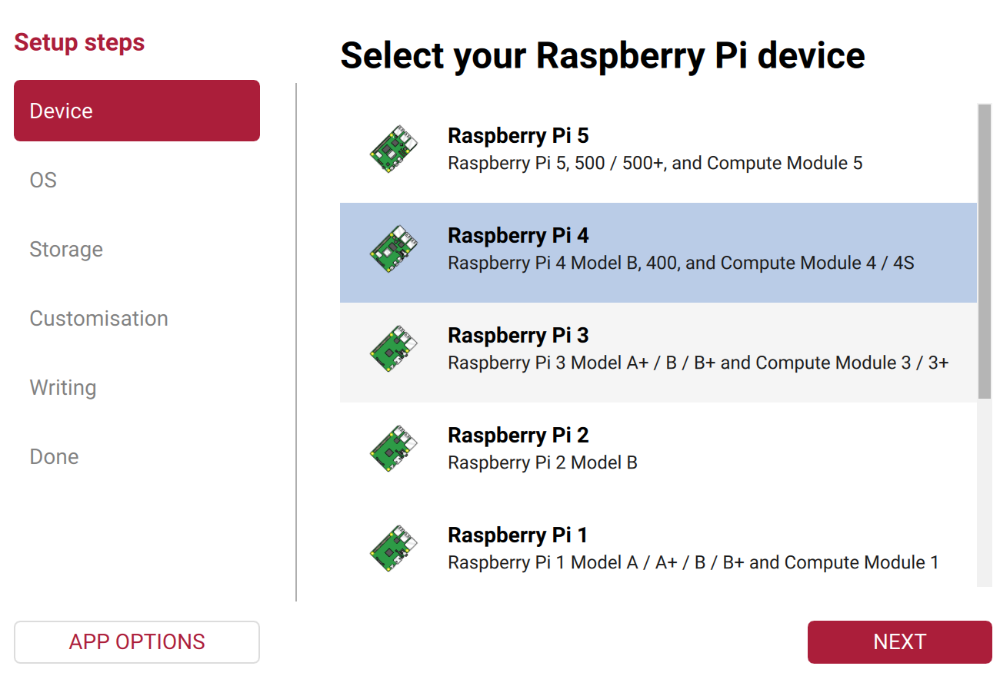
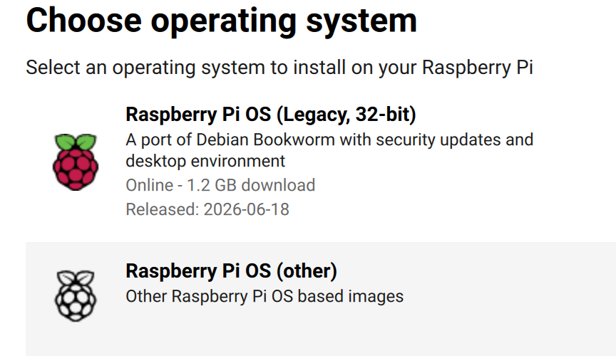
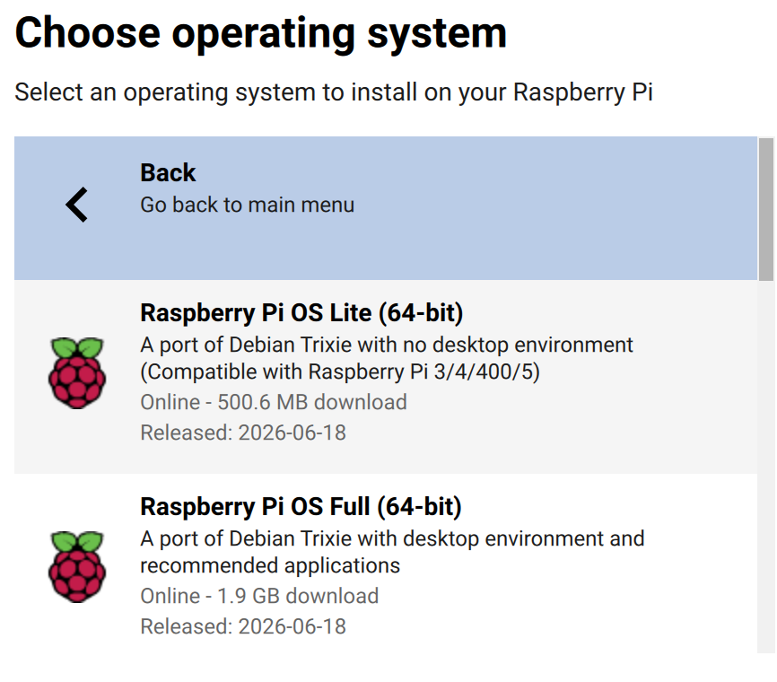
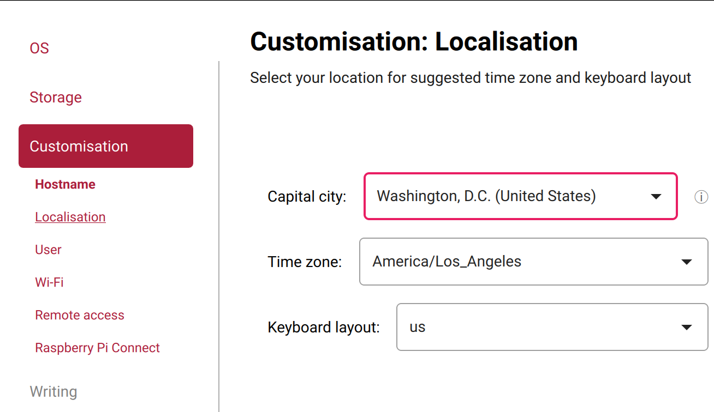
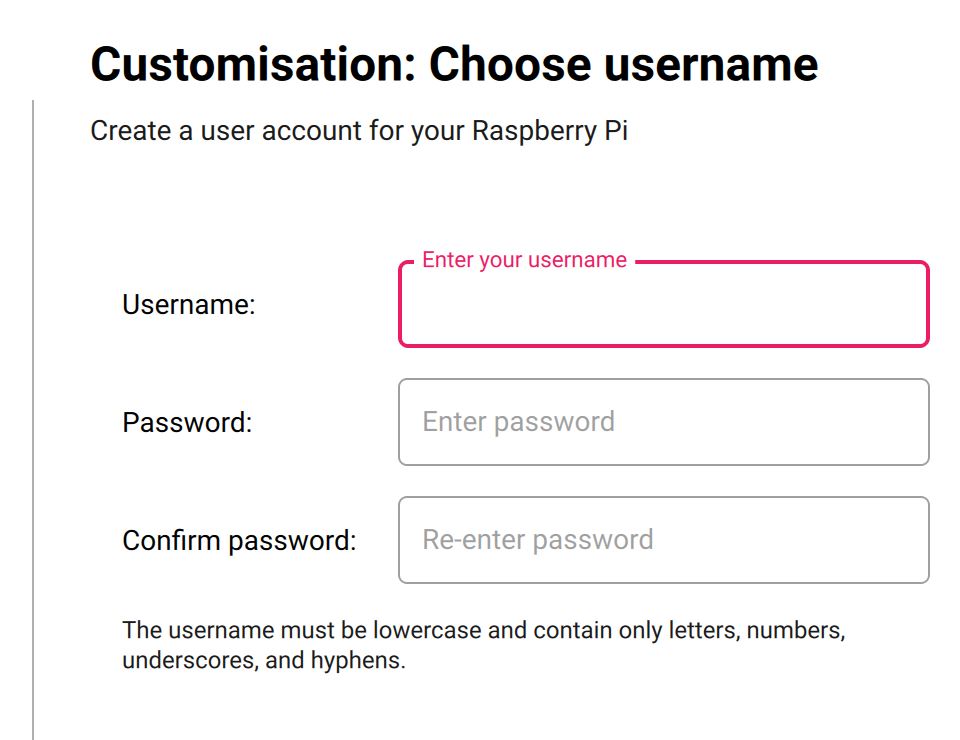
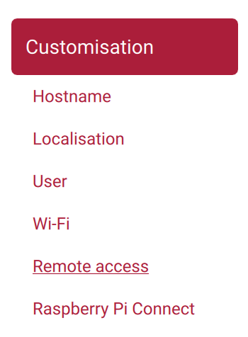
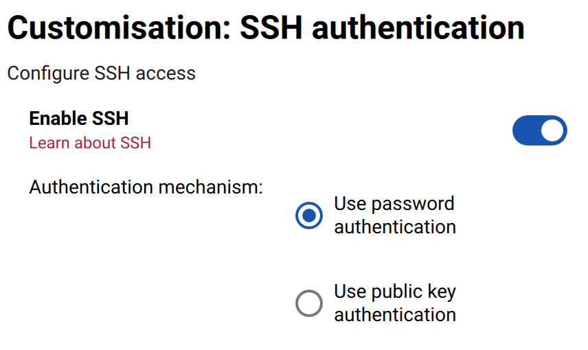
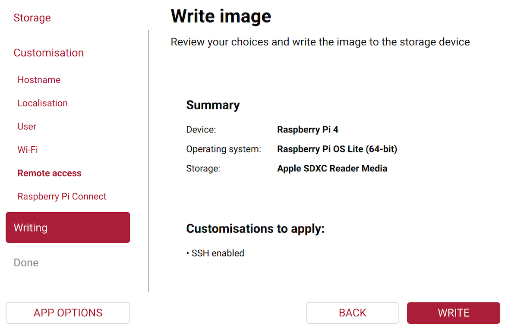
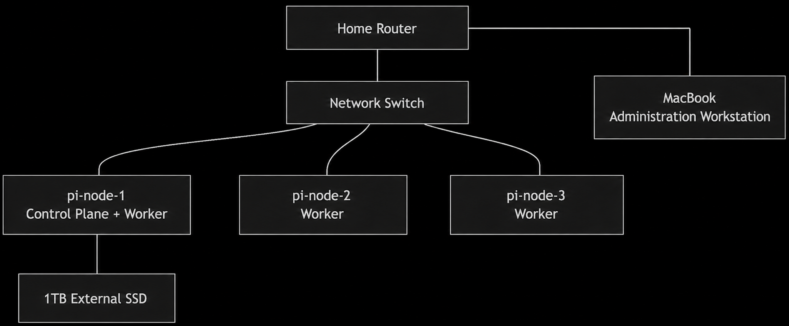

```text
Section 1: Introduction, purpose, hardware, design......................................................... 2
SAIL Hardware............................................................................................................ 2
SAIL Storage Design...................................................................................................2
SAIL Network Design.................................................................................................. 3
SAIL Operational Goals...............................................................................................3
```

```text
Section 2: Software choices and architecture decisions...................................................4
Architecture Overview................................................................................................. 4
```

```text
Section 3: Operating system setup...................................................................................4
Operating System Installation..................................................................................... 5
Section 4: Physical setup and wiring................................................................................ 9
Network Topology Diagram......................................................................................... 9
Hardware Layout................................................................................................................... 10
Hardware Wiring.................................................................................................................... 10
Ethernet Cable Construction......................................................................................11
Physical Environment Assembly............................................................................... 13
Section 5: Network Configuration................................................................................................ 14
Network Planning and IP Address Allocation............................................................ 14
Planned DHCP Reservations.................................................................................... 15
Reservation Verification.............................................................................................16
Section 6: Kubernetes setup...........................................................................................16
Kubernetes Installation..............................................................................................16
Section 7: Monitoring and logging.................................................................................. 18
Section 8: Security tooling.............................................................................................. 18
Section 9: AI agent automation.......................................................................................18
Section 10: Event Scenarios and Investigation Workflows............................................. 18
```

---

# Section 1: Introduction, purpose, hardware, design

SAIL, which stands for Security and AI Infrastructure Lab, is a self hosted infrastructure and automation environment designed to support hands-on learning in Dev Ops, cybersecurity, artificial intelligence, and systems operations. The environment uses Raspberry Pi systems and an Apple Silicon computer connected through a local home network to create a small scale computing environment where infrastructure, monitoring, automation, and AI related systems can be configured and operated together.

The purpose of the environment is to provide hands-on experience with deployment, monitoring, troubleshooting, automation, logging, security tooling, and operational maintenance through the use of real hardware and locally hosted services. Multiple systems and services run across the shared network, including containerized applications, monitoring tools, log collection systems, AI related services, and automation workflows. The environment also allows operational failures, alert generation, troubleshooting activities, and recovery procedures to be tested and documented over time. All systems connect through a local wired home network using Ethernet connections. The environment runs on existing hardware using free and locally hosted software and services.

## SAIL Hardware SAIL uses the following hardware:

### Device Purpose

### Raspberry Pi 4 8GB x3 Kubernetes cluster nodes

Mac Book Administration workstation, AI services, documentation, and

### automation tools

### 1TB External SSD

> Persistent storage for cluster data, logs, metrics, backups, and
> documentation assets

### Ethernet cables Network connectivity between systems

Network switch Local wired network connection between devices

## SAIL Storage Design

```text
SAIL uses a single 1TB external SSD as centralized storage for the environment. The
storage drive connects to pi-node-1 and stores long term operational and project data generated
by the environment.
```

The centralized storage supports:
● Monitoring data
● Logs
● Kubernetes persistent storage
● AI model files
● Documentation

---

● Screenshots and diagrams
● Backup files
● Project assets

```text
The Raspberry Pi systems maintain their own operating system storage while the external
SSD attached to pi-node-1 stores larger persistent datasets and operational records
generated by the environment.
```

## SAIL Network Design

All SAIL systems operate on a local wired network inside the home environment. Each

device connects through Ethernet to improve stability and simplify troubleshooting. The systems use the following names:

### System

### Role

```text
Mac Book Admin workstation, AI host, documentation, kubectl, Ansible, Git
pi-node-1 k3s control plane, schedulable worker node, and external storage host
pi-node-2 k3s worker
pi-node-3 k3s worker
```

## SAIL Operational Goals

The primary purpose of SAIL is to provide a controlled environment for developing and
evaluating operational, security, and AI-assisted investigation workflows.
The environment is intended to support:
● Kubernetes administration and operations
● Infrastructure monitoring and observability
● Centralized logging and event collection
● Runtime security monitoring
● Vulnerability assessment
● Configuration automation
● Failure testing and recovery exercises
● AI-assisted analysis of operational and security events
● Hands-on Dev Ops and cybersecurity learning

Rather than serving only as a Kubernetes cluster, SAIL functions as a platform for generating, detecting, investigating, and responding to infrastructure and security events. The environment allows operational failures, configuration issues, security alerts, and other events to be intentionally introduced and analyzed using monitoring, logging, security, and AI tooling.

---

```text
The long-term objective is to develop repeatable workflows that demonstrate how modern
infrastructure, security operations, and AI-assisted analysis can be combined within a
self-hosted environment.
```

# Section 2: Software choices and architecture decisions Technology Purpose Reason for Selection k3s Kubernetes cluster management

Lightweight and well suited for Raspberry Pi systems

### Ollama Local AI model hosting

Runs AI models locally on Apple Silicon hardware

Open Web UI AI web interface Browser based access to local AI models

Prometheus Metrics collection Tracks system and service health Grafana Monitoring dashboards Visualizes metrics and operational data Loki Log collection Centralized log storage and searching Falco Runtime security monitoring

Detects suspicious activity in containers and Linux systems

### Trivy Vulnerability scanning

Scans containers and configurations for known issues

### Ansible System configuration automation

> Reduces repetitive setup work across
> systems

Docker Container runtime Runs services in isolated environments Git Hub

> Documentation and configuration Stores notes, configurations, diagrams, and
> tracking troubleshooting records

## Architecture Overview

The environment is organized around a Kubernetes cluster running on three Raspberry Pi systems. One Raspberry Pi serves as the k3s control plane and also participates as a worker node, while the remaining Raspberry Pi systems serve as worker nodes. Kubernetes schedules workloads across the available cluster nodes based on resource availability and configuration. The Mac Book functions as an administration workstation and hosts AI related services, documentation assets, and management tools used to operate the environment. The environment uses a local wired network and centralized storage provided through an external SSD connected to pi-node-1. All services operate locally using existing hardware and free software.

# Section 3: Operating system setup

The SAIL environment will use Raspberry Pi OS Lite (64-bit) on all Raspberry Pi systems. Raspberry Pi OS was selected because it is the operating system maintained specifically for Raspberry Pi hardware and provides broad compatibility with the tools planned for the environment, including k3s, Prometheus, Grafana, Loki, Falco, Trivy, Docker, and Ansible.

---

## During the planning phase, alternative operating systems were evaluated, including Ubuntu Server. Both options appeared capable of supporting the planned architecture. Raspberry Pi OS was ultimately selected because the primary objective of SAIL is to provide a stable platform for infrastructure, security, monitoring, automation, and AI-assisted investigation workflows. As the operating system designed specifically for the hardware used in the project, Raspberry Pi OS offers strong hardware support, extensive community documentation, lower resource overhead, and broad compatibility with the planned software stack. Operating System Installation

The following are performed from a computer connected to the SAIL environment. Step 1: Download Raspberry Pi Imager

1. Open a web browser. Navigate to: https://www.raspberrypi.com/software/
2. Download Raspberry Pi Imager.
3. Install the application.
4. Launch Raspberry Pi Imager.

### Step 2: Prepare the First Micro SD Card

1. Insert a Micro SD card into the computer.
2. Verify the operating system detects the card before proceeding.



### Step 3: Select the Raspberry Pi Device

1. Within Raspberry Pi Imager:

a. Select Device
b. Select Raspberry Pi 4
c. Choose NEXT

### Step 4: Select the Operating System

1. Select Raspberry Pi OS (other)

---

2. Select Raspberry Pi OS Lite (64-bit)



### Step 5: Select Storage

1. Select the inserted Micro SD card



Step 6: Configure Operating System Customization


1. Enter Hostname: pi-node-1
2. Enter Capital city, Time zone, and keyboard layout

3. Username: <your username>



4. Password: <your password>

---



5. Click on Remote Access
6. Enable: SSH
7. Click writing, confirm settings and click WRITE





---

### Step 7: Write the Image

1. Wait for image creation and verification to complete.
2. Label the Micro SD card: pi-node-1

### Step 8: Create Remaining Node Images

1. Repeat Steps 2 through 7.
2. For the second card use: Hostname: pi-node-2
3. For the third card use: Hostname: pi-node-3
4. Label each completed Micro SD card.

### Step 9: Install the Micro SD Cards

1. Insert the appropriate Micro SD card into each Raspberry Pi.

2. Verify that each Raspberry Pi receives the card matching its hostname.

### Step 10: Boot the Cluster

1. Verify:

a. Ethernet cables are connected
b. The SSD is connected to pi-node-1
c. Power supplies are connected

2. Apply power to the Raspberry Pi systems.
3. Allow several minutes for the initial boot process to complete.



### Step 11: Identify Assigned IP Addresses

1. Log in to the router or gateway administration interface.

2. Locate the Raspberry Pi systems in the connected devices list.
3. Record for each node:

a. Hostname
b. MAC Address
c. IP Address

### Step 12: Verify SSH Connectivity

1. Open a terminal on the computer.
2. Connect to pi-node-1: ssh <username>@<ip-address>

a. Example: ssh sailadmin@10.0.0.20

3. When prompted: Are you sure you want to continue connecting (yes/no/[fingerprint])?

a. Type: yes

4. Enter the password configured during imaging.
5. Verify a successful login.
6. Repeat for pi-node-2 and pi-node-3.

### Step 13: Update Raspberry Pi OS

---

1. Run: sudo apt update

### sudo apt full-upgrade \-y

2. Wait for updates to complete.

### Step 14: Reboot the Node

1. Run: sudo reboot
2. Wait approximately one minute.
3. Reconnect using SSH.
4. Repeat Steps 13 and 14 on all three nodes.

### Step 15: Verify Hostname Configuration

1. Run: hostname
2. Verify the hostname matches the intended node name.

### Step 16: Verify Operating System Installation

1. Run: cat /etc/os-release
2. Verify that Raspberry Pi OS Lite (64-bit) is installed.

### Step 17: Record Baseline System Information

1. Run: free \-h
2. Record available memory.
3. Run: df \-h
4. Record available storage. This information will be used later when evaluating cluster

resource utilization and monitoring data.

# Operating system installation is complete when: ● All three Raspberry Pi systems boot successfully ● SSH access is verified ● Operating system updates are installed ● Hostnames are configured correctly ● Network connectivity is verified ● Baseline system information has been recorded Section 4: Physical setup and wiring Network Topology Diagram

---

## Hardware Layout Physical Tower Layout

*Top*

Netgear GS105E ┌─────────────────────┐ │ pi-node-1 │ ├─────────────────────┤ │ pi-node-2 │ ├─────────────────────┤ │ pi-node-3 │ ├─────────────────────┤ │ SSD hard drive | |Anker Charger │ └─────────────────────┘

### Bottom



Rear ┌─────────────────────┐ │ Fan 1 │ ├─────────────────────┤ │ Fan 2 │ └─────────────────────┘

## Hardware Wiring Ethernet Wiring

### Home Router

---

> │
> Cat 6 Cable
> │
> ▼

> ┌────────────────┐
> │ GS105E (Top of Tower)     │
> │                       │
> │ Port 1 ──► Router │
> │ Port 2 ──► pi-node-1 │
> │ Port 3 ──► pi-node-2 │
> │ Port 4 ──► pi-node-3 │
> │ Port 5 ──► Available │
> └────────────────┘

### Power Wiring

### Anker Charger

```text
USB-C #1 ─────────────► pi-node-1
USB-C #2 ─────────────► pi-node-2
USB-C #3 ─────────────► pi-node-3
pi-node-1 USB 3.0 ────► 1TB SSD
```

```text
Fan 1
Red ────────────────► pi-node-1 GPIO Pin 4
Black───────────────► pi-node-1 GPIO Pin 6
Fan 2
Red ────────────────► pi-node-3 GPIO Pin 4
Black───────────────► pi-node-3 GPIO Pin 6
```

## Ethernet Cable Construction

The SAIL environment uses custom Ethernet cables to connect the Raspberry Pi cluster nodes, network switch, and administrative workstation. Building custom cables allows cable lengths to be matched to the physical layout of the environment while providing hands-on experience with basic network infrastructure.

### Materials

---

● Cat 5e or Cat 6 Ethernet cable
● RJ45 connectors
● RJ45 crimping tool
● Cable stripper
● Cable tester
Step 1: Measure Cable Length

1. Measure the distance between the devices to be connected.

2. Add approximately 12 inches (30 cm) of extra cable to allow for routing and future

adjustments.

3. Cut the cable to the desired length.

### Step 2: Strip the Cable Jacket

1. Using the cable stripper, remove approximately 1 inch (2.5 cm) of the outer cable jacket

from the end of the cable.

2. Take care to avoid damaging the internal conductors.

### Step 3: Arrange Conductors

1. Untwist the wire pairs and arrange them according to the T568B standard:

a. White/Orange
b. Orange
c. White/Green
d. Blue
e. White/Blue
f. Green
g. White/Brown
h. Brown

2. Flatten the conductors and place them in the correct order.

### Step 4: Trim Conductors

1. Hold the conductors firmly and trim them to an equal length approximately 0.5 inches

(1.3 cm) from the cable jacket.

### Step 5: Insert RJ45 Connector

1. Insert the conductors into the RJ45 connector while maintaining the T568B wire order.

2. Verify that all conductors reach the end of the connector and remain in the correct

sequence.

3. Verify that the cable jacket extends into the connector body.

### Step 6: Crimp Connector

1. Insert the connector into the crimping tool.
2. Fully compress the crimping tool to secure the conductors and strain relief.

### Step 7: Repeat for Opposite End

1. Repeat Steps 2 through 6 using the same T568B wiring order.

### Step 8: Test Cable

1. Connect both ends of the cable to a cable tester.
2. Verify continuity on all eight conductors.
3. Replace and recrimp any connector that fails testing.

### Verification

---

1. Connect the completed cable between two network devices.

2. Verify link lights are present on both devices and confirm network connectivity.

## Physical Environment Assembly Materials ● Raspberry Pi 4 (8GB) x3 ● Raspberry Pi tower or cluster case ● Micro SD cards ● 1TB external SSD ● Network switch ● Ethernet cable ● RJ45 connectors ● RJ45 crimping tool ● Cable tester ● Raspberry Pi power supplies Step 1: Prepare the Micro SD Cards

1. Verify that the prepared and labeled Micro SD cards are available for installation.

2. Configure hostname, SSH, username/password, locale, etc.

3. Label each card (pi-node-1, pi-node-2, pi-node-3).

### Step 2: Install Storage Media

1. Insert the prepared Micro SD cards into the Raspberry Pi systems.

2. Connect the 1TB external SSD to the node designated as pi-node-1.

3. Verify that all storage devices are seated securely.

### Step 3: Assemble the Raspberry Pi Tower

1. Assemble the Raspberry Pi tower according to the Hardware Layout and Hardware

Wiring diagrams in this section. Refer to the manufacturer's instructions only for the
mechanical assembly of the tower.

2. Install all Raspberry Pi systems into the tower.
3. Install any supplied heatsinks, cooling fans, or mounting hardware.

4. Verify that all components are mounted securely and that cooling components operate

without obstruction.

### Step 4: Construct Ethernet Cables

1. Measure the required cable lengths based on the planned location of the tower and

network switch.

2. Add approximately 12 inches (30 cm) to each measurement to allow for cable routing

and future adjustments.

3. Construct and test Ethernet cables using the Ethernet Cable Construction procedure

documented earlier in this section.

4. Label cables as desired.

### Step 5: Install Network Infrastructure

1. Place the Raspberry Pi tower and network switch in their intended locations.

---

2. Connect all Raspberry Pi systems to the network switch.
3. Connect the network switch to the local network.
4. Verify that all network connections are fully seated.

### Step 6: Connect Power

1. Connect power supplies to the Raspberry Pi systems and network switch.

2. Route cables to minimize strain on connectors and maintain airflow around equipment.

### Step 7: Power On the Environment

1. Apply power to the network switch and Raspberry Pi systems.

2. Observe power indicators, network link lights, and cooling operation.

3. Allow the systems to complete their initial startup sequence.

### Step 8: Verify Physical Infrastructure

Verify:
● Raspberry Pi tower is assembled correctly
● Storage devices are connected
● Ethernet cables pass testing
● Network link lights are active
● Cooling components are operating
● All systems receive power

### Completion Criteria

Physical environment assembly is complete when:
● The Raspberry Pi tower is assembled
● Storage devices are installed
● Network cabling is connected and tested
● Network connectivity is established
● All systems power on successfully
● The environment is ready for operating system installation

## Section 5: Network Configuration Network Planning and IP Address Allocation Before configuring DHCP reservations, the local network configuration was reviewed to determine how the cluster nodes would be addressed and managed. Establishing an addressing plan early helps avoid conflicts with existing devices and simplifies SSH access, and cluster administration.

The first step was identifying the address currently assigned to the system. A quick review of assigned addresses was performed using: ifconfig | grep "inet"

Because multiple addresses were returned, the active network adapter was identified using: networksetup \-listallhardwareports After identifying the active network interface, its assigned address was obtained using: ipconfig getifaddr en0

The resulting address was used to determine the address range used by the local network. Readers following this process should note the first three portions of the address, which typically indicate the local network range.

Next, the default gateway was identified using: netstat \-nr | grep default

The gateway address was entered into a web browser to access the router or gateway administration interface.

Within the administration interface, the local network settings were reviewed to identify:
● The gateway address
● The subnet mask
● The DHCP address range
● Available IP reservation features

The review confirmed that the gateway supported DHCP reservations. DHCP reservations allow specific devices to consistently receive the same IP address while still using DHCP for network configuration. This approach provides the convenience of DHCP while maintaining predictable addresses for cluster infrastructure. Based on the available address space, three addresses were selected and reserved for the Kubernetes nodes. Assigning predictable addresses simplifies administration, automation, and troubleshooting.

## Planned DHCP Reservations

To provide predictable node addresses for SSH access, cluster administration, Ansible automation, and troubleshooting, DHCP reservations will be configured on the local gateway.

```text
System Role Reserved IP
pi-node-1 k3s control plane, worker, SSD host 10.0.0.20
pi-node-2 k3s worker 10.0.0.21
pi-node-3 k3s worker 10.0.0.22
```

The reservations will be created through the gateway administration interface after the

Raspberry Pi systems have been connected to the network and obtained initial DHCP leases. The reservation process consists of:

---

1. Log in to the gateway administration interface.
2. Navigate to Connected Devices.
3. Select Add Device With Reserved IP.
4. Identify the Raspberry Pi by hostname, MAC address, or current DHCP address

and select it from the device list.

5. Assign the planned IP address.
6. Save the configuration.
7. Repeat for the remaining nodes.
8. Reboot the Raspberry Pi systems or renew their DHCP leases.

Once completed, the cluster nodes will consistently receive the same addresses whenever they reconnect to the network.

## Reservation Verification

After the DHCP reservations have been created, verify that the assignments were applied successfully.

1. Log in to the gateway administration interface.
2. Navigate to Connected Devices.
3. Locate each Raspberry Pi in the device list.
4. Confirm that the reported IP address matches the expected reservation.

If any node displays a different address, reboot the node or renew its DHCP lease and verify the reservation configuration. Once verified, the cluster nodes will consistently receive the same addresses whenever they reconnect to the network.

# Section 6: Kubernetes setup

The SAIL environment uses k3s to provide Kubernetes orchestration across the Raspberry Pi cluster. k3s was selected because it is a lightweight Kubernetes distribution designed for environments with limited computing resources while maintaining compatibility with the standard Kubernetes APIs and tooling. This allows SAIL to provide a realistic Kubernetes environment using Raspberry Pi hardware without the overhead of a full Kubernetes installation. The cluster consists of one control plane node and two worker nodes. The control plane is hosted on pi-node-1, which also participates as a schedulable worker node. The remaining Raspberry Pi systems function as worker nodes that host workloads distributed by Kubernetes. This configuration provides a balance between efficient hardware utilization and a realistic multi-node cluster suitable for infrastructure management, monitoring, security testing, and AI-assisted operational analysis.

## Kubernetes Installation

The following procedures install k3s on the Raspberry Pi cluster and create the Kubernetes environment.

---

### Step 1: Verify Network Connectivity

1. Open a terminal on the computer.
2. Verify that each Raspberry Pi is accessible using SSH: ssh <username>@10.0.0.20
3. After successfully connecting, run: exit
4. Repeat for: ssh <username>@10.0.0.21 and ssh <username>@10.0.0.22

5. Resolve any connectivity issues before continuing.

### Step 2: Install the k3s Control Plane

1. Open a terminal on the computer.
2. Connect topi-node-1: ssh <username>@10.0.0.20

3. Run the following command: curl \-sf L https://get.k3s.io | sh \-

4. Wait for the installation to complete before proceeding.

### Step 3: Verify the Control Plane Installation

1. While still connected to pi-node-1, run: sudo kubectl get nodes

2. Verify that pi-node-1 reports a status of Ready.

### Step 4: Retrieve the Cluster Join Token

1. While still connected to pi-node-1, display the node join token.

a. sudo cat /var/lib/rancher/k3s/server/node-token

2. Copy the entire token.
3. The token will be required when joining the worker nodes to the cluster.

### Step 5: Install k3s on pi-node-2

1. Disconnect frompi-node-1: exit
2. Connect topi-node-2: ssh <username>@10.0.0.21

3. Run: curl \-sf L https://get.k3s.io | K3S_URL=https://10.0.0.20: 6443 K3S_TOKEN=<node-token> sh \-

4. Replace<node-token>with the token copied in Step 4.
5. Wait for the installation to complete.

### Step 6: Install k3s on pi-node-3

1. Disconnect frompi-node-2: exit
2. Connect topi-node-3: ssh <username>@10.0.0.22

3. Run: curl \-sf L https://get.k3s.io | K3S_URL=https://10.0.0.20: 6443 K3S_TOKEN=<node-token> sh \-

4. Replace<node-token>with the token copied in Step 4.
5. Wait for the installation to complete.

### Step 7: Verify Cluster Membership

1. Disconnect frompi-node-3: exit
2. Reconnect topi-node-1: ssh <username>@10.0.0.20
3. Run: sudo kubectl get nodes
4. Verify all three nodes report a status of Ready.

### Example output:

> NAME STATUS ROLES AGE
> pi-node-1 Ready control-plane, master
> pi-node-2 Ready <none>
> pi-node-3 Ready <none>

### Step 8: Verify Cluster Information

1. Run: sudo kubectl cluster-info
2. Verify that the Kubernetes API server is accessible.

---

### Step 9: Verify Kubernetes System Pods

1. Run: sudo kubectl get pods \--all-namespaces
2. Verify that all Kubernetes system pods report a status of Runningor Completed.

### Step 10: Deploy a Test Workload

1. Create a test deployment: sudo kubectl create deployment nginx \--image=nginx

2. Verify the deployment: sudo kubectl get deployments
3. Verify the pod: sudo kubectl get pods \-o wide
4. Confirm that the pod reaches the Runningstate.

### Step 11: Create a Test Service

1. Run: sudo kubectl expose deployment nginx \--port=80 \--type=Cluster IP
2. Verify the service: sudo kubectl get services

### Step 12: Remove the Test Workload

1. Run: sudo kubectl delete service nginx

### sudo kubectl delete deployment nginx

2. Verify that the deployment and service have been removed.

Completion Criteria
The Kubernetes installation is complete when:
● k3s is installed on all three Raspberry Pi systems.
● All three nodes report a status of Ready.
● Kubernetes system pods are healthy.
● A test workload deploys successfully.
● A Kubernetes service is created successfully.
● The test deployment and service are removed successfully.
● Baseline cluster information has been recorded.

# Section 7: Monitoring and logging Section 8: Security tooling Section 9: AI agent automation Section 10: Event Scenarios and Investigation Workflows The purpose of this section is to document the operational and security scenarios used to validate the SAIL environment. Each scenario will include event generation, detection mechanisms, collected evidence, AI-assisted analysis, and remediation actions. Planned scenarios include:

### Scenario Category

### Worker node failure Infrastructure

Pod crash loop Infrastructure Storage utilization threshold exceeded Infrastructure

---

Unauthorized shell access to a container Security

Deployment of a vulnerable container image Security Excessive resource consumption by a workload Security / Operations Unexpected process execution within a Security Service outage and recovery validation Operations

### container

### Each scenario will document:

1. Event description
2. Event generation method
3. Detection mechanism
4. Logs and metrics collected
5. AI-generated analysis
6. Investigation process
7. Remediation actions
8. Lessons learned