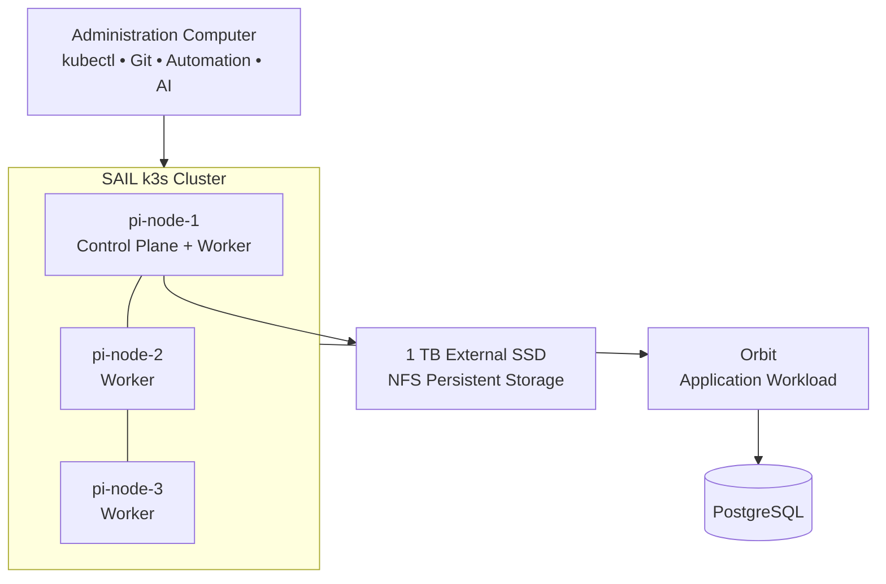
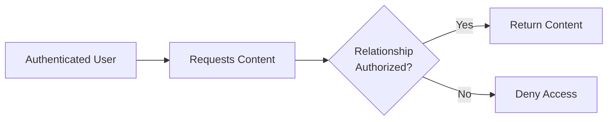
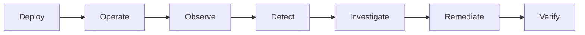

# SAIL - Security and AI Infrastructure Lab

> [!NOTE]
> **SAIL is a self-hosted infrastructure lab for DevOps, cybersecurity, observability, automation, and AI-assisted operations.**

SAIL (Security and AI Infrastructure Lab) is a self-hosted infrastructure and automation environment built on a three-node Raspberry Pi Kubernetes cluster.

It provides a controlled environment for deploying realistic workloads, observing their behavior, generating operational and security activity, and developing hands-on experience with monitoring, detection, investigation, troubleshooting, remediation, and automation.

## Contents

- [Architecture](#architecture)
- [Orbit Application Workload](#orbit-application-workload)
- [Technology Stack](#technology-stack)
- [SAIL Workloads](#sail-workloads)
- [Observability](#observability)
- [Security](#security)
- [Automation](#automation)
- [AI-Assisted Operations](#ai-assisted-operations)
- [Persistent Storage](#persistent-storage)
- [Repository Structure](#repository-structure)
- [Documentation](#documentation)
- [Project Status](#project-status)
- [Project Objective](#project-objective)

---

## Architecture


```mermaid
flowchart TB
    ADMIN["Administration Computer<br/>kubectl • Git • Automation • AI"]

    subgraph CLUSTER["SAIL k3s Cluster"]
        P1["pi-node-1<br/>Control Plane + Worker"]
        P2["pi-node-2<br/>Worker"]
        P3["pi-node-3<br/>Worker"]
    end

    SSD["1 TB External SSD<br/>NFS Persistent Storage"]
    ORBIT["Orbit<br/>Application Workload"]
    DB[("PostgreSQL")]

    ADMIN --> CLUSTER

    P1 --- P2
    P2 --- P3

    P1 --> SSD
    CLUSTER --> ORBIT
    ORBIT --> DB
```

### Cluster

| System | Role |
| --- | --- |
| `pi-node-1` | k3s control plane, schedulable worker, NFS/SSD host |
| `pi-node-2` | k3s worker |
| `pi-node-3` | k3s worker |
| Administration computer | Cluster administration, AI services, documentation, Git, and automation |
| 1 TB external SSD | Persistent Kubernetes and operational storage |

Persistent Kubernetes storage is provided through NFS from the external SSD attached to `pi-node-1`.

---

## Orbit Application Workload

SAIL includes **[Orbit](sail-orbit/)**, a Python/FastAPI social application that serves as the primary realistic application workload for the lab.

Orbit provides activity that can be deployed, monitored, logged, investigated, secured, and automated throughout SAIL.

### Application Features

- User registration and authentication
- User profiles and account management
- User and administrative roles and permissions
- Post creation, editing, deletion, and retrieval
- Comments and reactions
- Relationship categories based on relationship type or closeness
- Relationship-based post visibility and authorization
- Chronological user feeds
- REST API and request validation
- PostgreSQL persistence
- Application and security-relevant logging
- Health and application-status endpoints
- Sustained automated user activity

### Relationship-Based Authorization

Orbit's defining application feature is **relationship-based content visibility**.

Instead of treating every social connection identically, users can classify relationships according to type or closeness. These relationships influence which content another user is authorized to retrieve.


```mermaid
flowchart LR
    A["Authenticated User"] --> B["Requests Content"]
    B --> C{"Relationship<br/>Authorized?"}
    C -->|Yes| D["Return Content"]
    C -->|No| E["Deny Access"]
```

This provides SAIL with authorization activity including relationship changes, visibility changes, permission checks, successful access decisions, and denied access attempts.

> [!TIP]
> See the **[Orbit README](sail-orbit/README.md)** for the application's architecture, relationship model, technology stack, and development status.

---

## Technology Stack

| Area | Technologies |
| --- | --- |
| **Cluster** | Kubernetes, k3s, containerd |
| **Storage** | NFS, ext4 |
| **Application** | Python, FastAPI, Pydantic, Uvicorn |
| **Database** | PostgreSQL, SQLAlchemy, psycopg, Alembic |
| **Observability** | Prometheus, Grafana, Loki, OpenTelemetry |
| **Security** | Falco, Trivy |
| **Automation / IaC** | Ansible, Terraform / OpenTofu |
| **AI** | Ollama, Open WebUI |
| **Development & Testing** | Docker, pytest, Ruff, Black |
| **Version Control** | Git, GitHub |

> [!IMPORTANT]
> k3s uses `containerd` as the cluster container runtime. Docker is used for application image development and testing.

---

## SAIL Workloads

SAIL brings several types of activity together in one environment.

| Workload | Purpose |
| --- | --- |
| **Application** | API requests, authentication, authorization, database operations, and user activity |
| **Security** | Runtime behavior, vulnerability findings, authentication activity, and authorization decisions |
| **Automation & AI** | Operational analysis, configuration management, investigation, and repeatable workflows |
| **Infrastructure** | Deployments, configuration changes, storage operations, resource utilization, and Kubernetes administration |

Together, these workloads exercise an operational lifecycle spanning:

```text
Activity → Telemetry → Detection → Investigation → Remediation
```

---

## Observability

SAIL's observability environment is designed to provide visibility into the Raspberry Pi systems, Kubernetes cluster, containers, Orbit application, and PostgreSQL database.

| Tool | Purpose |
| --- | --- |
| **Prometheus** | Metrics collection |
| **Grafana** | Dashboards and visualization |
| **Loki** | Centralized log collection and searching |
| **OpenTelemetry** | Application telemetry and tracing |

A normal operating baseline will provide a reference for comparing infrastructure and application behavior during later operational and security scenarios.

---

## Security

Security tooling is integrated directly into the SAIL environment.

| Tool | Purpose |
| --- | --- |
| **Falco** | Runtime behavior and threat detection |
| **Trivy** | Container, configuration, and vulnerability scanning |

Orbit complements the infrastructure tooling by generating application-level security activity through authentication attempts, authorization decisions, administrative operations, validation events, relationship changes, visibility changes, and access decisions.

---

## Automation

SAIL uses automation to make infrastructure and configuration workflows reproducible.

| Tool | Purpose |
| --- | --- |
| **Ansible** | System and configuration automation |
| **Terraform / OpenTofu** | Infrastructure-as-code workflows |
| **Shell scripts** | Environment and cluster setup |

Automation supports repeatable configuration while retaining hands-on administration, validation, and troubleshooting within the lab.

---

## AI-Assisted Operations

SAIL includes locally hosted AI services using **Ollama** and **Open WebUI**.

AI-assisted workflows will operate on information produced within the lab:

- Logs
- Alerts
- Metrics
- Application behavior
- Infrastructure events
- Security findings
- Troubleshooting information

The goal is to evaluate AI-assisted operational and security analysis within a locally hosted environment.

---

## Persistent Storage

The Kubernetes cluster uses a centralized **1 TB external SSD** attached to `pi-node-1`.

```text
pi-node-1
└── /mnt/sail-storage
    └── kubernetes
```

The SSD uses `ext4` and is exposed to the cluster through NFS. Kubernetes dynamically provisions persistent volumes through the NFS CSI driver using the `sail-nfs` StorageClass.

---

## Repository Structure

```text
SAIL/
├── .vscode/
├── docs/
│   ├── setup_scripts/
│   └── SAIL.pdf
├── sail-orbit/
├── .gitignore
└── README.md
```

> [!NOTE]
> The repository structure will evolve as additional SAIL components are implemented.

---

## Documentation

The README provides the high-level project overview. The complete build and implementation record is maintained separately in **`docs/SAIL.pdf`**.

<details>
<summary><strong>View documentation contents</strong></summary>

1. Introduction, purpose, hardware, and design
2. Software choices and architecture decisions
3. Operating system setup
4. Physical setup and wiring
5. Network and shared-storage configuration
6. Kubernetes setup
7. Workload design
8. Application development and deployment
9. Monitoring, logging, and observability
10. Security and infrastructure automation
11. AI-assisted operations and deployment automation
12. Event scenarios and investigation workflows

The documentation contains the commands, configuration, verification steps, troubleshooting information, and setup scripts used to construct the environment.

</details>

**[View the full SAIL documentation](docs/SAIL.pdf)**

---

## Project Status

### Infrastructure

- [x] Raspberry Pi hardware environment
- [x] Wired network configuration
- [x] Static cluster addressing
- [x] External SSD configuration
- [x] NFS shared storage
- [x] Three-node k3s cluster
- [x] Remote Kubernetes administration
- [x] Kubernetes NFS CSI driver
- [x] Persistent Kubernetes storage

### Orbit

- [x] Local development environment
- [x] PostgreSQL development database
- [x] SQLAlchemy database connectivity
- [x] Alembic migration configuration
- [x] Initial user database model
- [ ] Authentication and authorization
- [ ] Posts, comments, and reactions
- [ ] Relationship model
- [ ] Relationship-based visibility
- [ ] Automated workload generation
- [ ] Container deployment to SAIL

### SAIL Operations

- [ ] Monitoring and observability stack
- [ ] Centralized logging
- [ ] Runtime security monitoring
- [ ] Vulnerability scanning
- [ ] Infrastructure automation
- [ ] AI-assisted operations
- [ ] Failure and recovery scenarios
- [ ] Security investigation scenarios

---

## Project Objective

SAIL is being developed to demonstrate how modern infrastructure, application development, observability, cybersecurity, automation, and AI-assisted analysis can operate together within a self-hosted environment.

The completed environment is designed to support an integrated operational cycle:


```mermaid
flowchart LR
    A["Deploy"] --> B["Operate"]
    B --> C["Observe"]
    C --> D["Detect"]
    D --> E["Investigate"]
    E --> F["Remediate"]
    F --> G["Verify"]
```

> [!NOTE]
> **SAIL is under active development.** The Kubernetes infrastructure and persistent-storage foundation are operational. Current development is focused on Orbit before progressing into observability, security tooling, automation, AI-assisted operations, and integrated investigation scenarios.