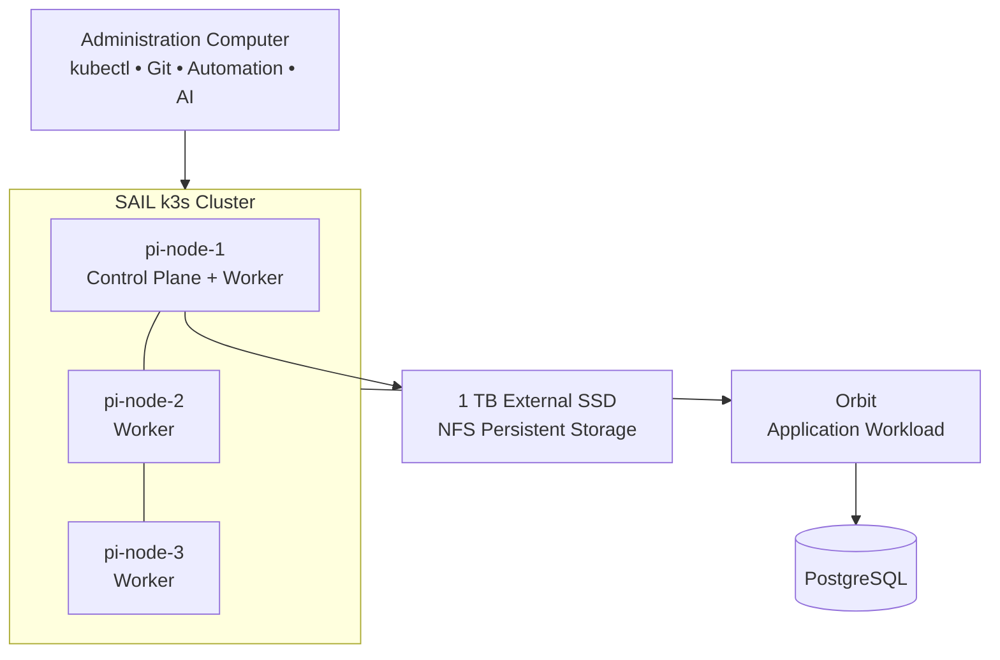

# SAIL — Security and AI Infrastructure Lab

**A self-hosted infrastructure lab for DevOps, cybersecurity, observability, automation, and AI-assisted operations.**

> SAIL provides a controlled environment for deploying realistic workloads, monitoring their behavior, generating operational and security events, investigating failures, and developing repeatable response workflows.

## Overview

SAIL (Security and AI Infrastructure Lab) is a self-hosted infrastructure and automation environment built on a three-node Raspberry Pi Kubernetes cluster.

The project provides hands-on experience with:

- Kubernetes administration and operations
- Infrastructure monitoring and observability
- Centralized logging and event collection
- Runtime security monitoring
- Vulnerability assessment
- Infrastructure and configuration automation
- Failure testing and recovery
- Security-event investigation
- AI-assisted operational and security analysis

SAIL provides an environment where realistic infrastructure, application, and security activity can be generated and observed, supporting hands-on experience with monitoring, detection, investigation, troubleshooting, and remediation.

---

## Architecture


```mermaid
flowchart TB
    ADMIN["Administration Computer<br/>kubectl • Git • Automation • AI"]

    subgraph CLUSTER["SAIL k3s Cluster"]
        P1["pi-node-1<br/>Control Plane + Worker"]
        P2["pi-node-2<br/>Worker"]
        P3["pi-node-3<br/>Worker"]
    end

    SSD["1 TB External SSD<br/>NFS Persistent Storage"]
    ORBIT["Orbit<br/>Application Workload"]
    DB[("PostgreSQL")]

    ADMIN --> CLUSTER

    P1 --- P2
    P2 --- P3

    P1 --> SSD

    CLUSTER --> ORBIT
    ORBIT --> DB
```

### Cluster

| System | Role |
|---|---|
| `pi-node-1` | k3s control plane, schedulable worker, NFS/SSD host |
| `pi-node-2` | k3s worker |
| `pi-node-3` | k3s worker |
| Administration computer | Cluster administration, AI services, documentation, Git, and automation |
| 1 TB external SSD | Persistent Kubernetes and operational storage |

Persistent Kubernetes storage is provided through NFS from the external SSD attached to `pi-node-1`.

---

## Orbit Application Workload

SAIL includes **Orbit**, a Python/FastAPI social application that serves as the primary realistic application workload for the lab.

Orbit provides activity that can be deployed, monitored, logged, investigated, secured, and automated throughout the rest of SAIL.

### Application Features

- User registration and authentication
- User profiles and account management
- User and administrative roles and permissions
- Post creation, editing, deletion, and retrieval
- Comments and reactions
- Relationship categories based on relationship type or closeness
- Relationship-based post visibility and authorization
- Chronological user feeds
- REST API and request validation
- PostgreSQL persistence
- Application and security-relevant logging
- Health and application-status endpoints
- Sustained automated user activity

### Relationship-Based Authorization

Orbit's defining application feature is relationship-based content visibility.

Instead of treating every social connection identically, users can classify relationships according to type or closeness. These relationships influence which content another user is authorized to retrieve.

For example, content can be limited to audiences such as:

- Close friends
- Friends
- Acquaintances
- Work
- Family
- Specific groups
- Everyone

This creates authorization activity that is useful to SAIL beyond ordinary authentication. Relationship changes, visibility changes, denied requests, permission checks, and attempts to access content outside an authorized audience can all generate observable application and security events.

---

## Technology Stack

| Area | Technologies |
|---|---|
| **Cluster** | Kubernetes, k3s, containerd |
| **Storage** | NFS, ext4 |
| **Application** | Python, FastAPI, Pydantic, Uvicorn |
| **Database** | PostgreSQL, SQLAlchemy, psycopg, Alembic |
| **Observability** | Prometheus, Grafana, Loki, OpenTelemetry |
| **Security** | Falco, Trivy |
| **Automation / IaC** | Ansible, Terraform / OpenTofu |
| **AI** | Ollama, Open WebUI |
| **Development & Testing** | Docker, pytest, Ruff, Black |
| **Version Control** | Git, GitHub |

> **Note:** k3s uses `containerd` as the cluster container runtime. Docker is used for application image development and testing.

---

## SAIL Workloads

SAIL is designed around several types of interacting workloads.

### Application Workload

Orbit generates normal application activity including API requests, authentication, authorization, database operations, user activity, and application errors.

### Security Workload

Security tooling observes runtime behavior, application activity, vulnerabilities, authentication attempts, authorization failures, and intentionally generated security events.

### Automated and AI Workload

Automation and locally hosted AI services support operational analysis, investigation, configuration management, and repeatable workflows.

### Operational Workload

Infrastructure activity includes deployments, configuration changes, resource consumption, service failures, storage operations, recovery procedures, and Kubernetes administration.

Together, these workloads allow SAIL to exercise the complete path from **activity → telemetry → detection → investigation → remediation**.

---

## Observability

SAIL's observability environment is designed to provide visibility into the Raspberry Pi systems, Kubernetes cluster, containers, Orbit application, and PostgreSQL database.

| Tool | Purpose |
|---|---|
| **Prometheus** | Metrics collection |
| **Grafana** | Dashboards and visualization |
| **Loki** | Centralized log collection and searching |
| **OpenTelemetry** | Application telemetry and tracing |

The project will establish a normal operating baseline that can be compared against intentionally generated failures and security events.

---

## Security

SAIL incorporates security tooling directly into the operating environment rather than treating security as a separate exercise.

| Tool | Purpose |
|---|---|
| **Falco** | Runtime behavior and threat detection |
| **Trivy** | Container, configuration, and vulnerability scanning |

Orbit also generates application-level security activity through authentication attempts, authorization decisions, administrative operations, validation failures, relationship changes, visibility changes, and denied access attempts.

---

## Automation

Repetitive infrastructure and configuration tasks are automated where practical.

SAIL uses:

- **Ansible** for system and configuration automation
- **Terraform / OpenTofu** for infrastructure-as-code workflows
- **Shell scripts** for environment and cluster setup tasks

Automation is intended to make configuration reproducible while preserving the hands-on administration and troubleshooting aspects of the lab.

---

## AI-Assisted Operations

SAIL includes locally hosted AI services using **Ollama** and **Open WebUI**.

AI-assisted workflows are intended to operate on information generated within the lab, including:

- Logs
- Alerts
- Metrics
- Application behavior
- Infrastructure events
- Security findings
- Troubleshooting information

The goal is to evaluate how AI-assisted analysis can support operational and security investigation while keeping the environment locally hosted.

---

## Persistent Storage

The Kubernetes cluster uses a centralized **1 TB external SSD** attached to `pi-node-1`.

The SSD is formatted as `ext4` and exposed to the cluster through NFS.

```text
pi-node-1
└── /mnt/sail-storage
    └── kubernetes
```

Kubernetes dynamically provisions persistent volumes through the NFS CSI driver using the `sail-nfs` StorageClass.

---

## Repository Structure

```text
SAIL/
├── sail-orbit/          # Orbit application
├── setup_scripts/       # Environment and cluster setup automation
├── kubernetes/          # Kubernetes manifests and configuration
├── documentation/       # Detailed project documentation and supporting assets
└── README.md            # Project overview
```

> Repository structure may expand as monitoring, security, automation, and AI components are implemented.

---

## Project Status

### Infrastructure

- [x] Raspberry Pi hardware environment
- [x] Wired network configuration
- [x] Static cluster addressing
- [x] External SSD configuration
- [x] NFS shared storage
- [x] Three-node k3s cluster
- [x] Remote Kubernetes administration
- [x] Kubernetes NFS CSI driver
- [x] Persistent Kubernetes storage

### Orbit

- [x] Local development environment
- [x] PostgreSQL development database
- [x] SQLAlchemy database connectivity
- [x] Alembic migration configuration
- [x] Initial user database model
- [ ] Authentication and authorization
- [ ] Posts, comments, and reactions
- [ ] Relationship model
- [ ] Relationship-based visibility
- [ ] Automated workload generation
- [ ] Container deployment to SAIL

### SAIL Operations

- [ ] Monitoring and observability stack
- [ ] Centralized logging
- [ ] Runtime security monitoring
- [ ] Vulnerability scanning
- [ ] Infrastructure automation
- [ ] AI-assisted operations
- [ ] Failure and recovery scenarios
- [ ] Security investigation scenarios

---

## Documentation

The README provides a high-level overview of SAIL.

Detailed project documentation is maintained separately and includes:

<details>
<summary><strong>Documentation contents</strong></summary>

1. Introduction, purpose, hardware, and design
2. Software choices and architecture decisions
3. Operating system setup
4. Physical setup and wiring
5. Network and shared-storage configuration
6. Kubernetes setup
7. Workload design
8. Application development and deployment
9. Monitoring, logging, and observability
10. Security and infrastructure automation
11. AI-assisted operations and deployment automation
12. Event scenarios and investigation workflows

The documentation also contains the commands, configuration, verification steps, troubleshooting information, and setup scripts used to construct the environment.

</details>

**See the SAIL project PDF for the complete implementation and build documentation.**

---

## Project Objective

The long-term objective of SAIL is to develop repeatable workflows demonstrating how modern infrastructure, application development, observability, cybersecurity, automation, and AI-assisted analysis can operate together within a self-hosted environment.

The finished environment is intended to support the complete operational cycle:

```text
Deploy
  ↓
Operate
  ↓
Observe
  ↓
Detect
  ↓
Investigate
  ↓
Remediate
  ↓
Verify
```

---

## Status

> **SAIL is under active development.**

The Kubernetes infrastructure and persistent-storage foundation are operational. Current development is focused on the Orbit application before progressing into observability, security tooling, automation, AI-assisted operations, and integrated investigation scenarios.