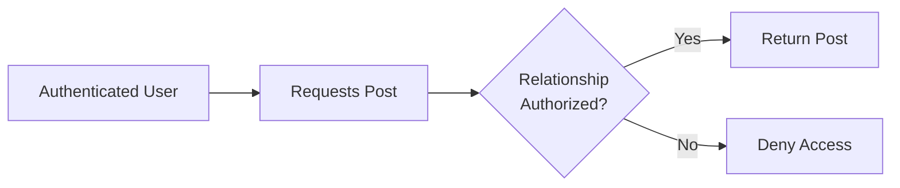
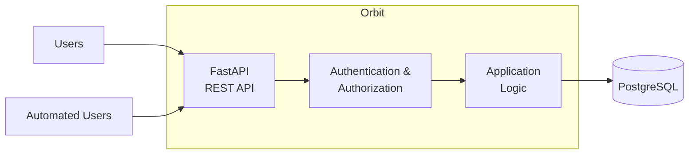
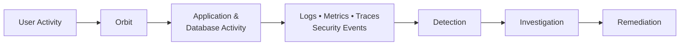

# Orbit

> [!NOTE]
> **Orbit is a relationship-aware social application being developed as the primary application workload for SAIL.**

Orbit is built around the idea that social relationships are not all equivalent. Users organize connections by relationship type or closeness, and those relationships determine which content other users are authorized to view.

As the primary application workload for **[SAIL](../README.md)**, Orbit provides realistic authentication, authorization, API, database, application, and security activity for the lab.

## Contents

- [Core Concept](#core-concept)
- [Relationship-Based Visibility](#relationship-based-visibility)
- [Planned Features](#planned-features)
- [Architecture](#architecture)
- [Technology Stack](#technology-stack)
- [Project Structure](#project-structure)
- [Database](#database)
- [Development](#development)
- [SAIL Integration](#sail-integration)
- [Project Status](#project-status)

---

## Core Concept

Traditional social networks commonly represent connections using a single relationship type. **Orbit models the context and closeness of relationships.**

Relationship categories can represent connections such as:

| Category | Example Context |
| --- | --- |
| **Close Friends** | Closest personal relationships |
| **Friends** | General friendships |
| **Acquaintances** | Less-close social connections |
| **Family** | Family relationships |
| **Work** | Professional relationships |

These categories allow users to organize their social connections and control how content is shared with different parts of their social circle.

### Asymmetric Relationships

Relationship classifications can be **asymmetric**.

```text
Alice → Bob: Close Friend
Bob   → Alice: Acquaintance
```

Each user therefore controls their own understanding of a relationship rather than requiring both users to assign the same category.

---

## Relationship-Based Visibility

Relationship-based visibility is part of Orbit's **server-side authorization model**, not simply a way of organizing content in the interface.

A post can define an audience such as:

- Close Friends
- Friends and closer
- Family
- Work
- Specific relationship groups
- Everyone

When protected content is requested, Orbit evaluates the requesting user's relationship to the content owner before determining whether the content can be returned.



This produces authorization activity including:

- successful access decisions
- denied access attempts
- relationship changes
- audience changes
- permission checks
- administrative actions

---

## Planned Features

### Accounts & Access

- [ ] User registration and authentication
- [ ] User profiles and account management
- [ ] User and administrative roles and permissions

### Social Features

- [ ] Post creation, editing, deletion, and retrieval
- [ ] Comments and reactions
- [ ] Relationship categories
- [ ] Chronological user feed

### Authorization

- [ ] Relationship-based post visibility
- [ ] Per-post audience selection
- [ ] Request validation and authorization enforcement

### Operations

- [ ] Application and security-relevant logging
- [ ] Health and application-status endpoints
- [ ] Sustained automated user activity

---

## Architecture



Orbit is developed locally and will ultimately be containerized and deployed to the SAIL k3s cluster.

---

## Technology Stack

| Area | Technology |
| --- | --- |
| **Language** | Python |
| **API** | FastAPI |
| **Validation** | Pydantic |
| **Application Server** | Uvicorn |
| **Database** | PostgreSQL |
| **ORM** | SQLAlchemy |
| **Database Driver** | psycopg |
| **Migrations** | Alembic |
| **Testing** | pytest |
| **Formatting** | Black |
| **Linting** | Ruff |
| **Image Development & Testing** | Docker |
| **Deployment Target** | SAIL k3s cluster |

---

## Project Structure

```text
sail-orbit/
├── app/                 # Orbit application
├── migrations/          # Alembic database migrations
├── tests/               # Tests
├── .env.example         # Environment configuration template
├── alembic.ini          # Alembic configuration
├── requirements.txt     # Python dependencies
├── run.py               # Application entry point
└── README.md
```

> [!IMPORTANT]
> Local configuration and environment files such as `.env` and `.sail-orbit-env/` are excluded from version control.

---

## Database

Orbit uses **PostgreSQL** for persistent application data and **SQLAlchemy** for database access. Schema changes are managed through **Alembic** migrations.

The initial `users` table provides the foundation for:

| Data | Purpose |
| --- | --- |
| Account identity | Username and email |
| Authentication | Password hash |
| Profile | Display name and bio |
| Authorization | User role |
| Account state | Active/inactive status |
| Audit information | Creation and update timestamps |

<details>
<summary><strong>Database development components</strong></summary>

- PostgreSQL development database
- SQLAlchemy ORM
- psycopg PostgreSQL driver
- Alembic schema migrations
- Database connectivity testing

Database credentials are supplied through environment configuration and are not stored in the repository.

</details>

---

## Development

Orbit is currently developed locally before deployment to the SAIL Kubernetes environment.

The development foundation currently includes:

- Python virtual environment
- PostgreSQL development database
- SQLAlchemy database integration
- Alembic schema migrations
- pytest testing
- Ruff linting
- Black formatting

> [!NOTE]
> Setup and execution instructions will be added once the application development workflow is finalized and tested.

---

## SAIL Integration

Orbit provides **[SAIL](../README.md)** with a realistic, stateful, authorization-heavy application workload.



Orbit activity will support SAIL workflows involving:

| SAIL Capability | Orbit Activity |
| --- | --- |
| **Observability** | Requests, application behavior, database activity |
| **Logging** | User, application, authorization, and error events |
| **Security** | Authentication and authorization activity |
| **Detection** | Abnormal and security-relevant behavior |
| **Investigation** | Correlated application and infrastructure events |
| **Automation** | Repeatable workload and operational activity |
| **AI Operations** | Analysis of telemetry, alerts, and application behavior |

For the complete lab architecture and implementation documentation, see the **[SAIL README](../README.md)** and SAIL project PDF.

---

## Project Status

| Component | Status |
| --- | --- |
| Development environment | ✅ Complete |
| PostgreSQL database | ✅ Complete |
| SQLAlchemy integration | ✅ Complete |
| Alembic configuration | ✅ Complete |
| Initial user model | ✅ Complete |
| Authentication & authorization | ⬜ Planned |
| Social relationships | ⬜ Planned |
| Posts & interactions | ⬜ Planned |
| Relationship visibility | ⬜ Planned |
| Automated workload | ⬜ Planned |
| Container image | ⬜ Planned |
| k3s deployment | ⬜ Planned |

> [!TIP]
> **Current focus:** Build the user and database foundation, followed by authentication, relationships, content, and relationship-based authorization.